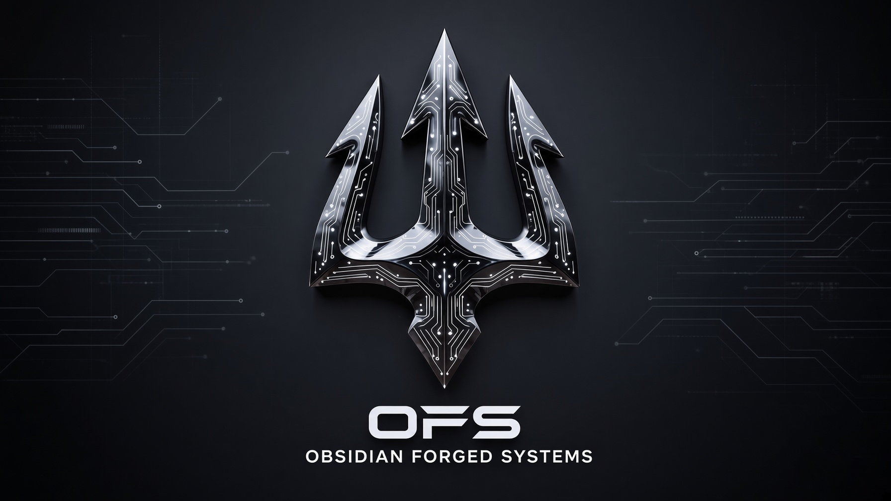

<!--
  Crusader0711 · Obsidian Forged Systems
  Cyber-Physical Systems · Cloud Architecture · Ethical Hacking
-->

  

 

  
  

---

---

## About Me

Cyber-Physical Systems Mechanical Engineer, Cloud Solutions Architect, and Ethical Hacker.  
Founder of **Obsidian Forged Systems**.

I design and build production-grade systems at the intersection of mechanical engineering, on-prem AI, and adversarial security — from X-band phased array radar to edge AI performance monitoring and cyber threat intelligence pipelines.

My work focuses on self-hosted, auditable, operator-owned tooling that reduces reliance on expensive commercial platforms and external consulting. Everything I ship is built to survive real environments: low-bandwidth links, air-gapped or semi-isolated networks, and high-consequence decision loops.

---

## Flagship Projects

| Project | Description | Status |
|:--------|:------------|:------:|
| **[Phased Array Radar](https://github.com/Crusader0711/)** | Custom X-band phased array systems for long-range drone / object detection. Hardware + signal processing + integration layer. | Active |
| **[AI Performance Monitor](https://github.com/Crusader0711/)** | On-prem / edge AI performance observability and anomaly detection for agentic and inference workloads. | Active |
| **[Cyber Threat Intelligence Integration](https://github.com/Crusader0711/)** | Pipelines and tooling that fuse external CTI with local telemetry for cyber-physical risk assessment. | Active |

---

## Tech Stack

### Cyber-Physical & Edge

  
  
  
  

### Cloud & Data

  
  
  
  

### Security & Intelligence

  
  
  

### Languages & Systems

  
  
  
  

---

## Connect

  
  
  <!-- Add LinkedIn / personal site badges here when ready -->

---

  Obsidian Forged Systems · Built for environments that punish fragility

